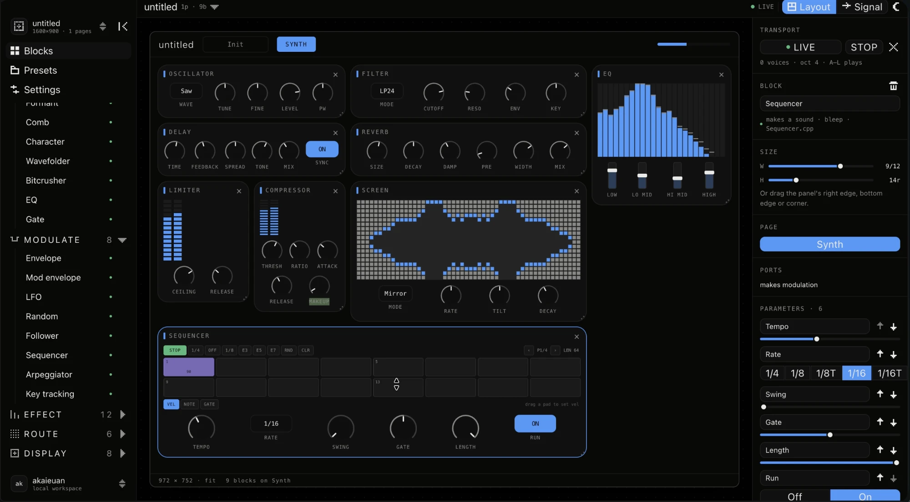

# Socket

A desktop studio for building audio plugins out of blocks. Electron, React,
TypeScript, running on port 4200.



*Nine blocks on one page at 972×752 — oscillator into filter, delay and reverb,
a compressor and limiter, an EQ and a spectrum, and bleep's sequencer along the
bottom. The right panel is editing the sequencer: its size on the grid, which
page it lives on, and its six parameters.*

You drag blocks onto a plugin window, lay them out on a twelve-column grid, wire
the signal path, patch modulation with cables, and **hear it**. The engine is
the same C++ the generated plugin will ship, compiled to WebAssembly — so the
preview is not an approximation of the result.

```bash
pnpm install && pnpm dev
```

`A`–`L` plays, `Z`/`X` shifts octave, `Esc` panics. Click *Enable audio* first;
browsers will not start a sound without a gesture.

---

## What it does

**49 blocks, all of which make a sound.** Oscillators, wavetables, FM, a plucked
string; filters, formants, folders, crushers; envelopes, LFOs, a sequencer, an
arpeggiator; delay, reverb, chorus, phaser, flanger, compressor, limiter, tape,
granular, resonator. Each maps its normalised parameters to real units itself —
a cutoff knob is exponential because filters are, not because a slider decided
so.

**Layout and signal are separate questions.** Where a panel sits on the face is
a layout choice; what feeds what is a routing one. The Signal view is the second
one, and it drives the engine: a topological sort over the wires decides the
order blocks run in. Blocks with no wires keep their layout position, and a
cycle is broken rather than refused — the editor lets you draw one, so the
engine has to survive one.

**A patch bay with cables.** Drag from a source jack to a destination and it
routes for real: the source block's modulation output, scaled by depth, added as
an offset to the destination's parameter. Both ends resolve against your
project, and a jack with nothing behind it is drawn dead with a note saying what
to place.

**A sequencer after bleep's.** Sixty-four steps across four pages, shown as pads
in eight by two. A step carries a note, a velocity and a gate length, not a
boolean — that is the whole difference between a sequencer and a metronome. All
eight of bleep's pattern generators, including the Euclidean ones.

**Displays that show the actual signal.** The screen, scope, analyser and meter
read the output, log-spaced across thirty to sixteen thousand hertz. Before you
enable audio they animate a stand-in, because a display sitting at zero reads as
broken rather than as silent.

**Eight starting points.** A preset here is a whole instrument — layout, wiring,
patch cables and sequencer pattern as well as every knob. Init, Sub bass, Acid,
Pluck, Pad, Bell, Drone, Crush; each shows a different corner of the catalogue
rather than a different filter setting.

---

## The decision that shapes everything

A block's engine has to run in two places: here, so composing an instrument
means hearing it, and in the plugin this generates, so what you export sounds
like what you built.

Writing it twice — TypeScript here, C++ there — is fastest to first sound and
guaranteed to drift. This project already rejected that reasoning for colour:
the design tokens are generated because *a copied palette is one that will be
wrong within a month*. A copied filter is worse, because you cannot see it
drift, only hear it.

So the DSP is written once, in C++, and compiled to WebAssembly for this app.
That carries a constraint worth having: **WebAssembly cannot link JUCE, so
nothing in the engine may include it.** That is the discipline that turns the
shared library into a real one — and the survey that started this work showed
how much of the existing DSP would fail the test. bleep's `Oscillator.h` ported
in five minutes. Its `FxChain` could not port at all, because it is a shell over
`juce::dsp::{Chorus, Phaser, DelayLine, Reverb}` — so those effects are written
here rather than moved.

The engine lives in [akaVST](https://github.com/akaieuan/akaVST) under
`skeleton/modules/aka_skeleton/dsp/`. Rebuild it with:

```bash
../akaVST/skeleton/modules/aka_skeleton/dsp/build-wasm.sh
```

It writes straight into `public/engine/`; a reload picks it up.

---

## Shape of it

```
src/
  model/        the project value and every operation over it
    types.ts      Project → Page → BlockInstance → Param, plus Ports and Face
    catalog.ts    the forty-nine block definitions
    presets.ts    eight complete instruments
    project.ts    pure transforms: instantiate, findBlock, audioBlocks
    useProject.ts the one place state changes, with undo
  audio/        the main-thread side of the engine
    engine.ts     AudioContext, worklet, the port
    chain.ts      wires → run order, and what reaches an output
    modulation.ts cables → routes, resolved against the project
  design/       the drawing vocabulary
    faceControls.tsx  plugin controls: Knob, Fader, Choice, Toggle
    faces.tsx         everything a block draws that is not a knob
    PixelIcon.tsx     the icon set, as bitmaps
  components/   Frame, Panel, AppSidebar, Inspector, TitleBar, Settings
  views/        LayoutView, SignalView
public/engine/  worklet.js, and the compiled engine
```

The split that matters is `design/faceControls` versus everything in
`components/`. The first is the plugin's interface; the second is Socket's own.
They must not drift into each other — the moment the app starts drawing knobs
its own way, the preview stops being a preview.

---

## The five concepts

**Pages.** A plugin is not one face. Tabs painted onto a frame are decoration;
pages that own their own layout are what a plugin is. One page holding synth,
mod and FX is a whole instrument; so is five.

**Ports.** A block that only has parameters cannot be wired to anything. Audio
has to be a separate dimension from layout, because in a real instrument it is.

**Params.** Nameable and reorderable, because what a knob is called and where it
sits is most of the design work in a plugin panel.

**Faces.** A patch bay, a step grid, a keyboard and a scope are each the point of
the panel they sit on. They are one registry, and face state lives on the block
instance — so a patch you spent a minute making survives reordering the panel.
A face reads its own block's parameters by id rather than label, so renaming a
knob cannot break the display above it.

**Panels are containers.** Every panel is a CSS query container, so knobs,
faders, faces and the gaps between them size off the panel rather than the
window, and controls distribute across the width instead of huddling at its left
edge. Four knobs stranded in half a plugin was the symptom; the fix is controls
that grow into the room they are given, which is what hardware does.

---

## Interface

**Panels** are moved by their header and resized by their edges — right for
columns, bottom for rows, corner for both. A window is dragged by its title bar
so that reaching for a control inside it does not move the window.

**Keyboard**

    ← →        width, one column         ⌫ / Delete  remove
    ↑ ↓        height, one row           Tab / ⇧Tab  next / previous block
    ⇧← ⇧→      move in the layout order  Esc         deselect
    ⌘Z / ⇧⌘Z   undo / redo               ⌘B          collapse the sidebar

**Undo.** The whole project is one value and every operation is a pure transform
over it, so history is a stack of past values. Gestures coalesce: a knob drag
produces a new project sixty times a second, and pushing each one makes undo
useless while pushing none loses the value you started from.

**Window sizes** are the real editor sizes from the three instruments, plus
**Fit**, which grows to fill the canvas — plenty of plugins are nearly as big as
the screen, and a builder that only offers fixed rectangles cannot design one.
The footer still reports the pixels, because a plugin ships at a number.

**Settings** offers only what is real. Sample rate, latency and output device
are fixed for the life of an AudioContext, so each one rebuilds the engine — the
panel says so rather than pretending a knob turn is enough. Buffer size is
deliberately absent: an AudioWorklet always renders 128 frames and there is no
way to change it.

---

## Icons

`design/PixelIcon.tsx` is the whole set, as bitmaps. The instruments' one piece
of iconography is PixelRack — whole cells, never a curve, never a stroke — so a
borrowed icon set would be the only thing here not speaking the language of the
screens.

Two rules make them legible: always 14px (seven cells into fourteen pixels is
exactly two pixels a cell, and a glyph whose cells land on fractions is a
blurred glyph), and group glyphs keep PixelRack's gap while utility glyphs fill
their cells — at two pixels a cell the gap eats most of a chevron.

---

## shadcn, on the generated tokens

The app shell — sidebar, title bar, inspector, menus, tooltips — is shadcn/ui on
Tailwind v4. It did not bring a palette with it: `@theme inline` in the
generated stylesheet points every Tailwind colour at the akaVST variables, and
shadcn's own `--sidebar-*` names are aliases onto them. A component dropped in
by `npx shadcn@latest add` arrives already wearing akaSTYLE.

**The plugin face is not shadcn and must not become so.** Knobs, faders and
every face are hand-drawn ports of skeleton's `LookAndFeel`. The line runs at
the edge of the plugin window: outside it, shadcn; inside it, ports.

---

## Generated, not copied

Two things are emitted rather than written twice, on the same contract: output
committed, no build depends on the generator having run, and `--check` fails if
the tree disagrees.

| | |
|---|---|
| `pnpm sync:tokens` | akaVST's `tokens.generated.json` → `src/styles.css` |
| `pnpm sync:blocks` | `src/model/catalog.ts` → the skeleton's `BlockCatalog.h` and `src/audio/blocks.generated.ts` |

The block catalogue is the contract between the interface and the DSP: Socket
addresses a parameter as `(block index, parameter index)` and the engine's
switch reads that index. Nothing else keeps the two in step, and a parameter
inserted into the middle of a block would silently re-address every one after
it — which you would hear, eventually, as the wrong knob doing something.

---

## Known gaps

- **Nothing persists.** No save, no file format. The project value is already
  the thing you would serialise, so this is the next real piece of work.
- **`pnpm start` does not run.** Electron's binary was never downloaded by the
  install; `pnpm rebuild electron` is the usual fix. `pnpm dev` is unaffected.
- **The Sampler plays a synthesised body**, because there is no file layer yet.
  It is left out of the "makes a sound" list on purpose: the dot means "this
  does what it says", not "this emits a tone".
- **Parameter locks.** bleep's sequencer has them and this one does not yet. The
  step struct is laid out so they drop in without moving anything, and the
  modulation system they need to lock *to* now exists.
